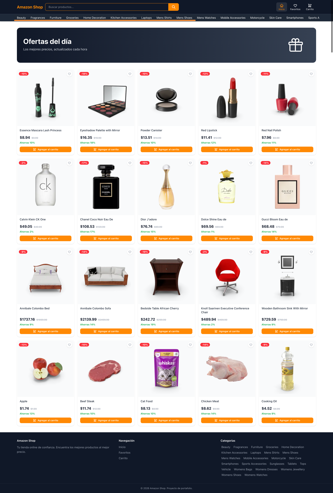
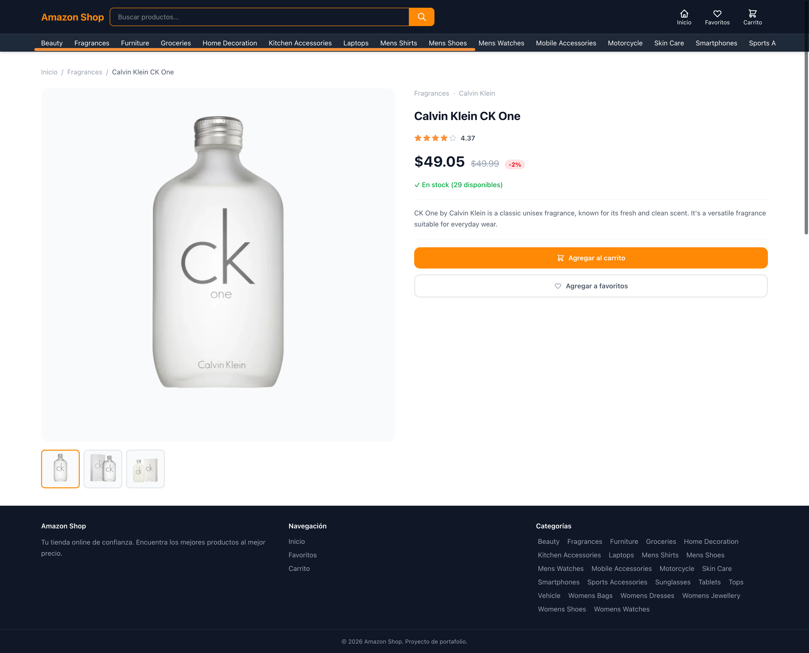
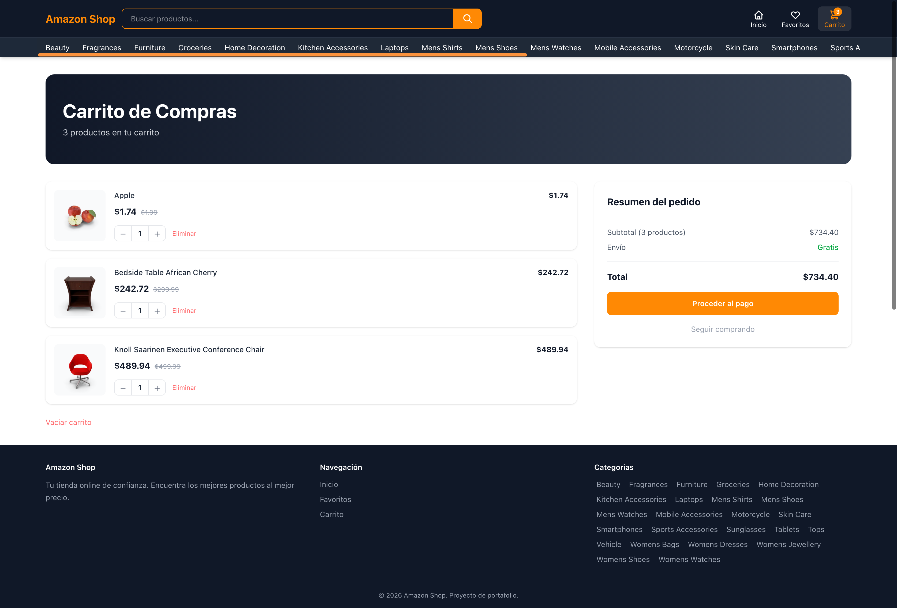
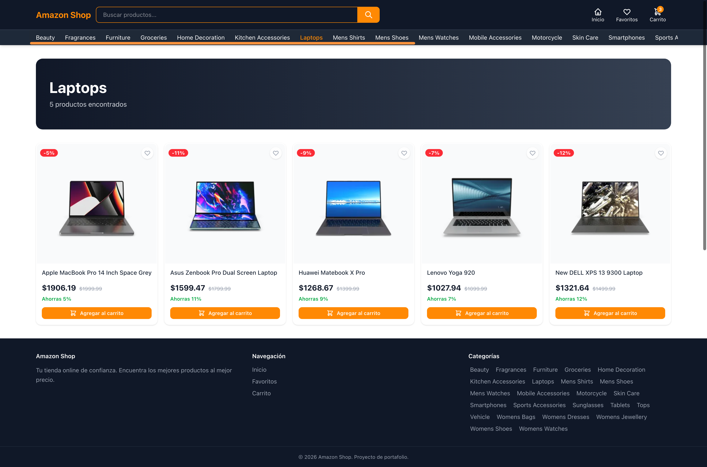
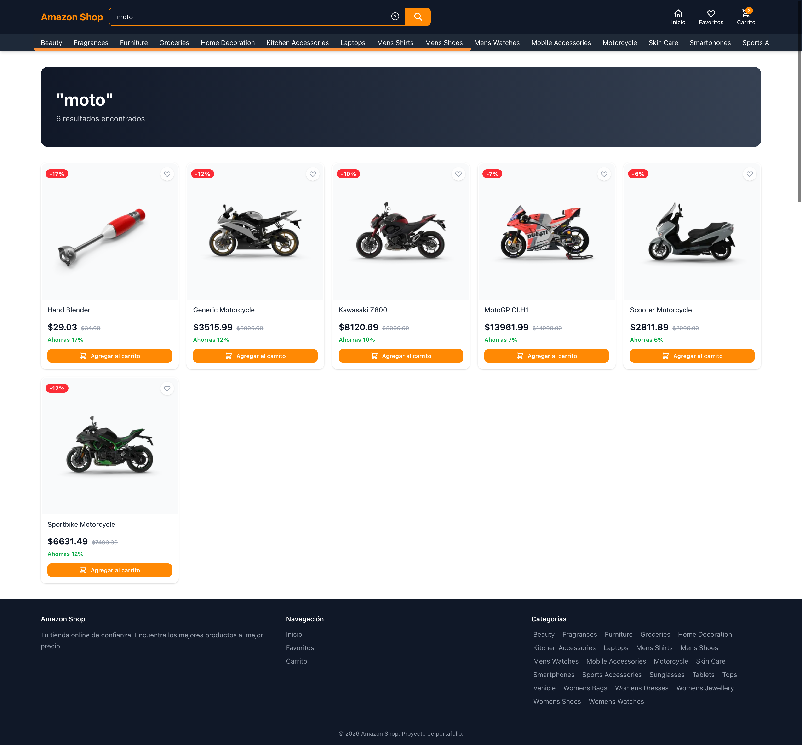

# Amazon Shop

E-commerce SPA construida con Next.js 16 App Router, consumiendo la API pública de [DummyJSON](https://dummyjson.com). Proyecto desarrollado como parte de mi portafolio para demostrar arquitectura frontend moderna, gestión de estado global y buenas prácticas de testing.

🔗 **Demo en vivo:** [amazon-shop-lovat.vercel.app](https://amazon-shop-lovat.vercel.app)

---

## Capturas de pantalla



<table>
  <tr>
    <td></td>
    <td></td>
  </tr>
  <tr>
    <td></td>
    <td></td>
  </tr>
</table>

---

## Características

- Catálogo de productos con filtrado por categoría
- Buscador en tiempo real con resultados desde la API
- Sección de ofertas con productos en descuento
- Página de detalle de producto con galería de imágenes interactiva
- Carrito de compras persistente con control de cantidades
- Lista de favoritos persistente
- Diseño responsive: mobile, tablet y desktop
- Ícono de pestaña e indicadores de cantidad en el header

## Stack tecnológico

| Tecnología | Uso |
|---|---|
| **Next.js 16** | Framework — App Router, Server Components, rutas dinámicas |
| **React 19** | UI con Server y Client Components |
| **TypeScript** | Tipado estático en toda la aplicación |
| **Tailwind CSS 4** | Estilos utilitarios y diseño responsive |
| **Zustand 5** | Estado global del carrito y favoritos con persistencia (`localStorage`) |
| **Axios** | Cliente HTTP con instancia configurada y fallback de URL |
| **DummyJSON API** | API REST pública, sin autenticación |
| **Jest 30 + Testing Library** | Tests unitarios y de componentes |
| **Vercel** | Deploy continuo desde GitHub |

## Arquitectura

El proyecto sigue una arquitectura de 3 capas dentro de `src/`:

```
src/
├── features/               # Dominio de negocio
│   ├── cart/               # Store de Zustand + lógica de carrito
│   ├── favorites/          # Store de Zustand + lógica de favoritos
│   ├── products/           # Servicios, componentes y tipos de productos
│   ├── deals/              # Servicio de productos en oferta
│   └── search/             # Servicio de búsqueda
├── shared/                 # Recursos compartidos entre features
│   ├── api/                # Instancia de Axios
│   ├── hooks/              # Hooks reutilizables (useIsMounted)
│   ├── types/              # Tipos TypeScript globales
│   └── ui/                 # Componentes de UI (Header, Footer, CardItem…)
└── views/                  # Páginas compuestas (Server Components)
```

Los Server Components se encargan del fetching de datos y el renderizado estático. Los Client Components (`'use client'`) solo intervienen donde hay interactividad: stores de Zustand, eventos y estado local.

## Hidratación segura

Para evitar el mismatch de hidratación entre el servidor y el cliente al leer estado persistido de Zustand, se implementó el hook `useIsMounted` usando `useSyncExternalStore`:

```ts
export function useIsMounted(): boolean {
  return useSyncExternalStore(
    () => () => {},
    () => true,   // cliente
    () => false,  // servidor
  )
}
```

## Tests

El proyecto cuenta con 45 tests organizados en 7 suites:

```
src/__tests__/
├── useCartStore.test.ts       # Lógica del carrito (addItem, totalPrice…)
├── useFavoritesStore.test.ts  # Lógica de favoritos (toggle, isFavorite…)
├── services.test.ts           # Servicios de API con mock de Axios
├── getDeals.test.ts           # Servicio de ofertas
├── dummyjson.test.ts          # Configuración del cliente Axios
├── useIsMounted.test.ts       # Hook de hidratación
└── ImageGallery.test.tsx      # Componente de galería (click, estado activo)
```

```bash
npm test                 # corre todos los tests
npm run test:watch       # modo watch
npm run test:coverage    # reporte de cobertura en consola
npm run test:open        # genera reporte HTML y lo abre en el navegador
```

## Instalación local

```bash
# 1. Clonar el repositorio
git clone https://github.com/tu-usuario/amazon-shop.git
cd amazon-shop

# 2. Instalar dependencias
npm install

# 3. Crear archivo de variables de entorno
echo "BASE_URL=https://dummyjson.com" > .env.local

# 4. Iniciar el servidor de desarrollo
npm run dev
```

Abre [http://localhost:3000](http://localhost:3000) en tu navegador.

## Variables de entorno

| Variable | Descripción | Valor por defecto |
|---|---|---|
| `BASE_URL` | URL base de la API | `https://dummyjson.com` |

## Scripts disponibles

| Comando | Descripción |
|---|---|
| `npm run dev` | Servidor de desarrollo |
| `npm run build` | Build de producción |
| `npm run start` | Servidor de producción |
| `npm test` | Ejecuta los tests |
| `npm run test:coverage` | Tests con reporte de cobertura |
| `npm run test:open` | Tests + abre el reporte HTML en el navegador |
| `npm run lint` | Análisis estático con ESLint |
